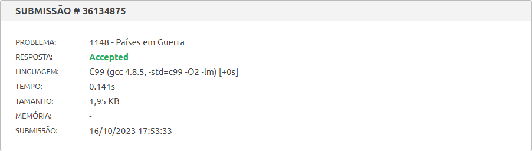
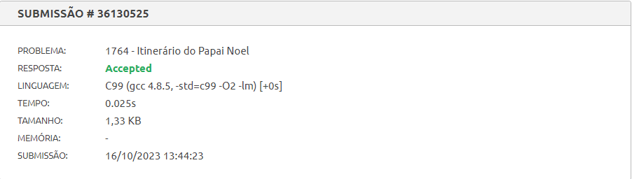
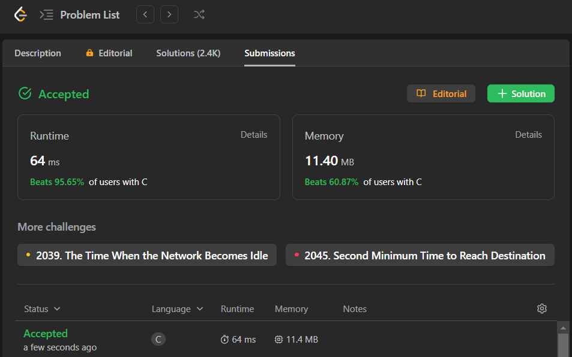
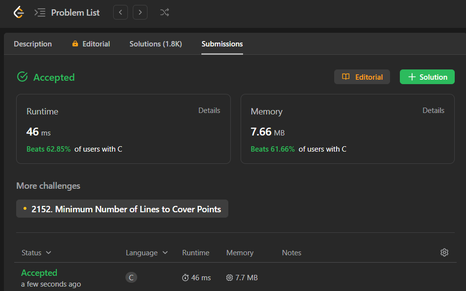

# Exercícios Resolvido de Juiz Online

Tema:

- Grafos 2

## Alunos

| Matrícula  | Aluno                       |
| ---------- | --------------------------- |
| 19/0085045 | Brenno da Silva Oliveira    |
| 19/0087501 | Gabriel Marcolino Rodrigues |

## Sobre

Resolução dos exercícios do Beecrowd e LeetCode.

> [1148 - Países em Guerra](https://www.beecrowd.com.br/repository/UOJ_1148.html) 
> [1764 - Itinerário do Papai Noel](https://www.beecrowd.com.br/repository/UOJ_1764.html) 
> [743 - Network Delay Time](https://leetcode.com/problems/network-delay-time/description/) 
> [1584 - Min Cost to Connect All Points](https://leetcode.com/problems/min-cost-to-connect-all-points/description/)

## Screenshots

## Instalação

**Linguagem**: C

## Uso

Para rodar os exercícios basta clonar o respositório 

    git clone git@github.com:projeto-de-algoritmos/Grafos2-ExerciciosJuizOnline.git 

E executar os seguintes comandos dentro da pasta do arquivo pelo terminal:

    gcc -o nome_arquivo nome_arquivo.c

 

    ./nome_arquivo.exe < nome_arquivo.txt

Outra forma é subtmeter os códigos dos exercícios pelo juiz online:

- [1148 - Países em Guerra](https://www.beecrowd.com.br/judge/pt/problems/view/1148)
- [1764 - Itinerário do Papai Noel](https://www.beecrowd.com.br/judge/pt/problems/view/1764)

## Outros

[Vídeo de apresentação]()
